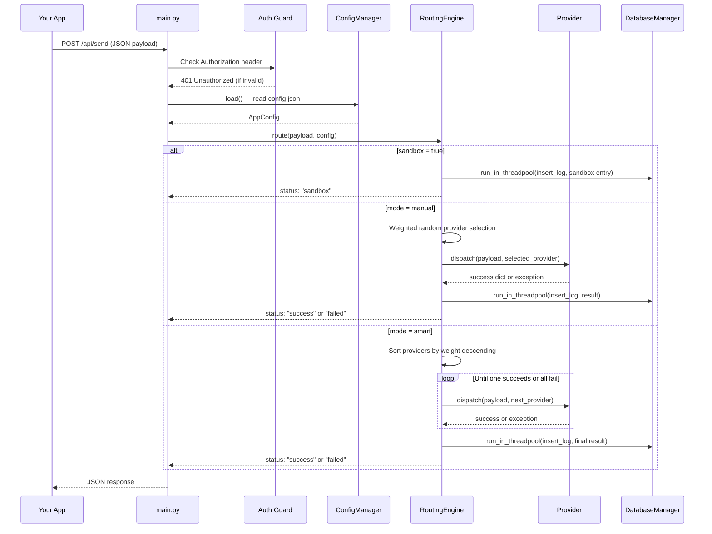
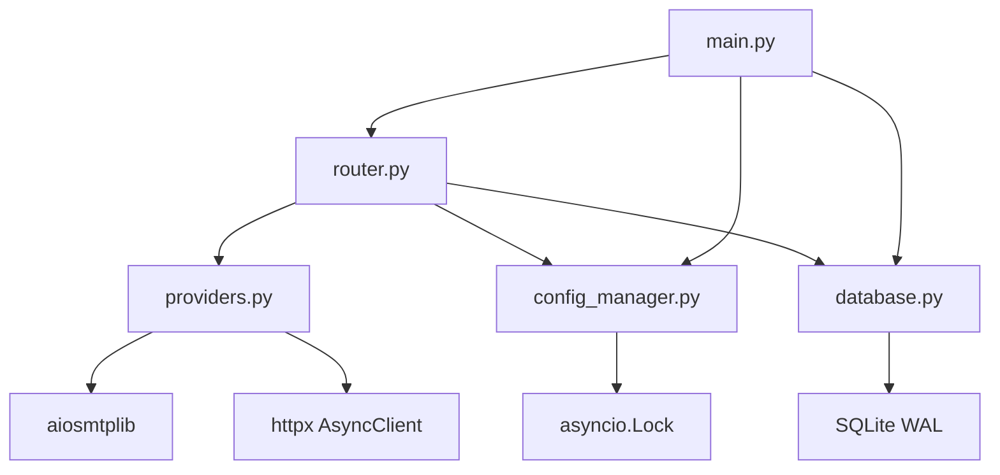

# ProtoPost — Architecture

## Overview

ProtoPost is a FastAPI server that acts as a routing layer between your
application and one or more email providers. Your application sends a single
JSON request to `POST /api/send`. ProtoPost reads the current configuration,
selects a provider according to the configured routing mode, dispatches the
email, and records the result in a local SQLite database — all without your
application needing to know which provider handled the send.

The key design constraints are intentional: a single SQLite file requires no
external database, the server reads `config.json` on every request so provider
changes take effect immediately without a restart, and the entire stack runs as
a single Python process suitable for local development or a small VPS.

## Request Lifecycle



## Routing Modes

ProtoPost supports three routing modes, configured via the `mode` field in
`config.json` and the `sandbox` flag.

**Sandbox mode** is evaluated first, before any routing logic. When
`sandbox: true`, the engine writes a log entry and returns immediately. No
provider is contacted and no network request is made. This is the recommended
mode for local development and CI environments.

**Manual mode** performs a single weighted random selection across all enabled
providers. Each provider's `weight` field (0–100) determines its probability of
selection. Only one provider is attempted. If it fails, the error is recorded
and returned — there is no retry or fallback.

**Smart mode** sorts enabled providers by weight in descending order and
attempts them sequentially. The first provider to succeed terminates the chain.
If a provider raises an exception, the engine captures the error, moves to the
next provider, and tries again. If all providers fail, a structured error
response is returned with the last recorded error trace.

## Startup Lifecycle

ProtoPost uses FastAPI's `lifespan` context manager to initialize resources
before the server accepts any requests:

```python
@asynccontextmanager
async def lifespan(app: FastAPI):
    database_manager.initialize()
    try:
        await config_manager.load()
    except Exception:
        config_manager.save_sync(config_manager.get_default_config())
    yield
    database_manager.close()

app = FastAPI(lifespan=lifespan)
```

Everything before `yield` runs once on startup: the SQLite database is
initialized (creating tables and enabling WAL mode if needed), and the config
file is loaded or created with defaults if absent. Everything after `yield`
runs on shutdown: the database connection is closed cleanly.

This replaces the deprecated `@app.on_event("startup")` pattern and guarantees
that both the database and config are ready before the first request is accepted.

## Concurrency Model

FastAPI runs on a single-threaded asyncio event loop. Operations that block
the thread — such as SQLite writes and file I/O — must not run directly inside
async functions.

Database writes use `run_in_threadpool` to offload the synchronous SQLite call
to a thread pool worker, keeping the event loop free:

```python
await run_in_threadpool(database_manager.insert_log, log)
```

Config reads and writes are protected by an `asyncio.Lock` (`_write_lock`
in `ConfigManager`). The lock is acquired for both saves and loads to prevent
a read from observing a partially written file during a concurrent save operation.

SMTP sending uses `aiosmtplib`, which is a natively async SMTP library. It does
not block the event loop. HTTP-based providers (Resend, Mailtrap) use `httpx`
with async client calls for the same reason.

## Component Dependencies



`main.py` is the only entry point. It owns the FastAPI app instance and all
route definitions. `router.py` contains the `RoutingEngine` class and depends
on `providers.py` for dispatch, `database.py` for logging, and
`config_manager.py` for reading current routing rules. Neither `providers.py`
nor `database.py` import from each other — all coordination goes through the
routing engine.
