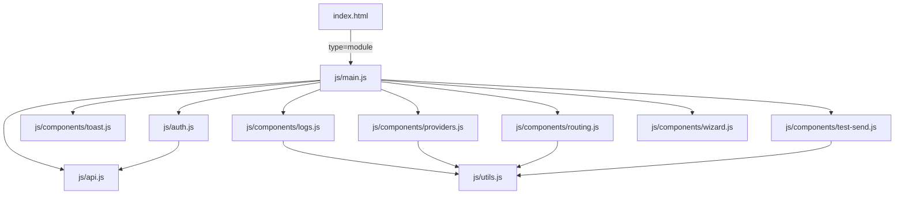
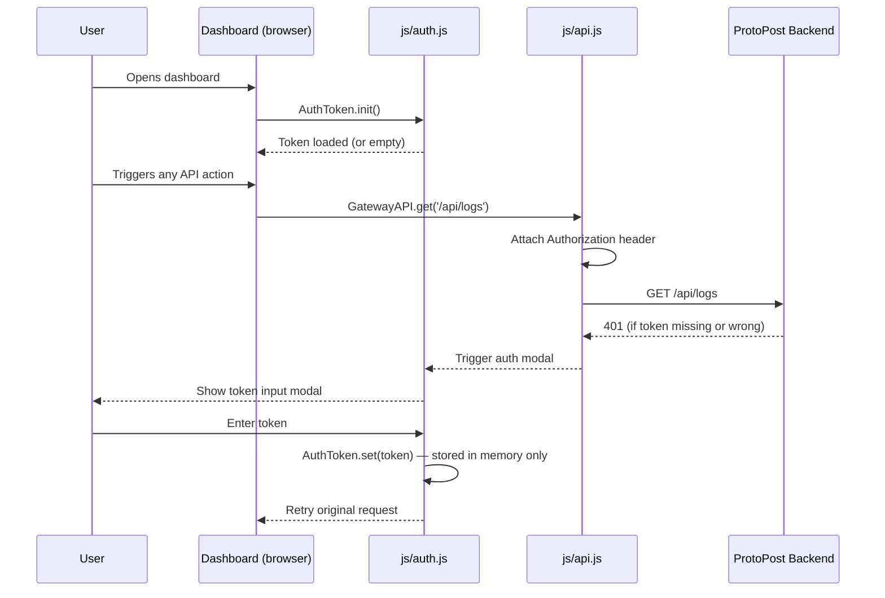

# ProtoPost — Frontend Architecture

## Overview

The ProtoPost dashboard is a vanilla JavaScript single-page application served
as static files by FastAPI. It uses native ES modules and Tailwind CSS loaded
from CDN. There is no build step, no bundler, and no framework.

The original `dashboard.html` (a single 1000+ line file with inline styles
and scripts) has been refactored into a modular structure. `index.html` is
now a pure HTML shell. All styles live in `css/styles.css`. All JavaScript is
split into focused modules under `js/`.

## File Map

| File | Purpose |
|---|---|
| `frontend/index.html` | HTML shell. Contains only markup, no inline `<script>` or `<style>`. |
| `frontend/css/styles.css` | All styles extracted from the original monolith: toast, progress bar, wizard animations, layout. |
| `frontend/js/main.js` | App entry point. Runs on `DOMContentLoaded`. Imports and initialises all modules. |
| `frontend/js/api.js` | `GatewayAPI` fetch wrapper. Every HTTP call to the backend goes through this module. |
| `frontend/js/auth.js` | `AuthToken` object (in-memory storage) and auth modal open, save, close functions. |
| `frontend/js/state.js` | Shared application state used across components. |
| `frontend/js/utils.js` | `escapeHtml()` and other pure helper functions. No DOM access. |
| `frontend/js/components/toast.js` | Toast notification system with `init()`, `success()`, `error()` methods. |
| `frontend/js/components/logs.js` | Log table row rendering. Reads from `utils.js` for XSS safety. |
| `frontend/js/components/providers.js` | Provider card rendering. Reads from `utils.js` for XSS safety. |
| `frontend/js/components/routing.js` | Routing rule UI rendering and interaction. |
| `frontend/js/components/test-send.js` | Test send panel: form handling and result display. |
| `frontend/js/components/wizard.js` | Gmail setup wizard: step rendering and progression logic. |

## Module Import Graph



`main.js` is the single entry point. It imports all modules and runs
initialisation in `DOMContentLoaded`. Component modules import `utils.js`
for XSS-safe rendering but do not import each other. `auth.js` uses
`api.js` for token-authenticated requests.

## XSS Protection

The original monolith inserted user-supplied data directly into `innerHTML`,
creating cross-site scripting vulnerabilities whenever email subjects, addresses,
or provider names contained characters like `<`, `>`, `"`, or `&`.

`js/utils.js` exports `escapeHtml()` to sanitise all untrusted values before
DOM insertion:

```javascript
export function escapeHtml(unsafe) {
    return (unsafe || '').toString()
        .replace(/&/g, "&amp;")
        .replace(/</g, "&lt;")
        .replace(/>/g, "&gt;")
        .replace(/"/g, "&quot;")
        .replace(/'/g, "&#039;");
}
```

Every component that renders data from API responses must use this function.
Direct `innerHTML` assignment with raw API data is not permitted.

```javascript
// Unsafe — do not do this
element.innerHTML = log.subject;

// Safe — always do this
element.innerHTML = escapeHtml(log.subject);
```

The components that require `escapeHtml()` on every render are `logs.js`
(subject, to, from fields), `providers.js` (provider name and id), and
`wizard.js` (any user-entered values displayed back in the UI).

## Authentication Flow



The token is held exclusively in memory by the `AuthToken` object. It is never
written to `localStorage`, `sessionStorage`, or any persistent browser storage.
Refreshing the page clears the token and shows the auth modal on the next
protected API call.

## Static File Serving

FastAPI serves the frontend via a mounted static directory:

```python
from fastapi.staticfiles import StaticFiles

app.mount("/static", StaticFiles(directory="frontend"), name="static")

@app.get("/", include_in_schema=False)
async def serve_dashboard():
    return FileResponse("frontend/index.html")
```

The `/static/` prefix is important. JavaScript modules use relative import
paths (`./api.js`, `./components/toast.js`). The browser resolves these
relative to the requesting module's URL, which lives under `/static/js/`.
This means all imports resolve correctly under the `/static/` prefix without
any bundler or import map configuration.

`index.html` loads the entry point as a module:

```html
<link rel="stylesheet" href="/static/css/styles.css">
<script src="https://cdn.tailwindcss.com"></script>
<script type="module" src="/static/js/main.js"></script>
```

The `type="module"` attribute is required. Without it, `import` statements
in `main.js` will cause a syntax error.
